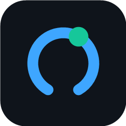
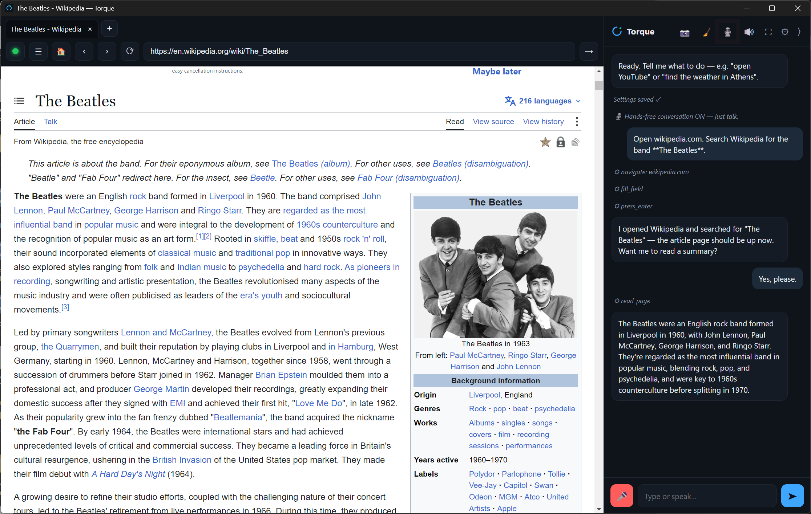
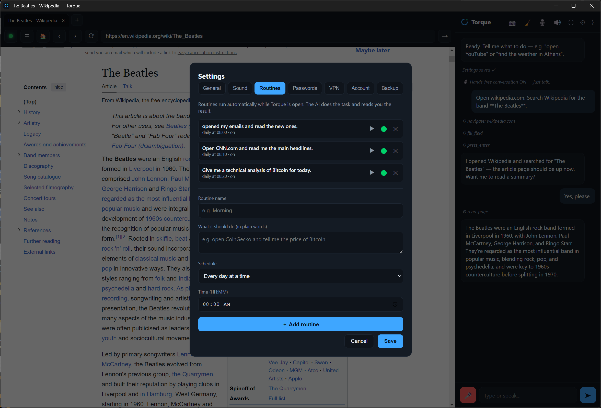
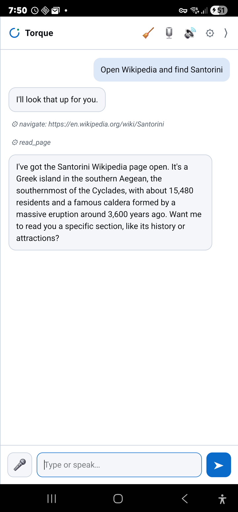
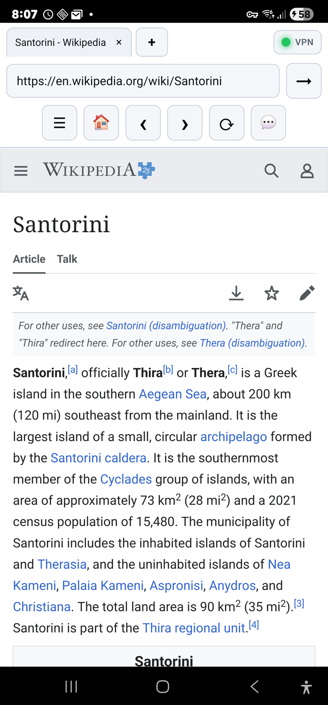
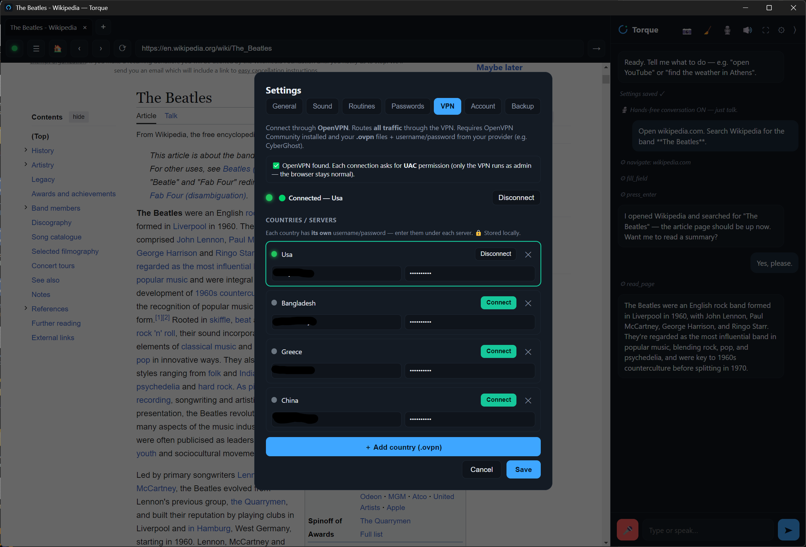
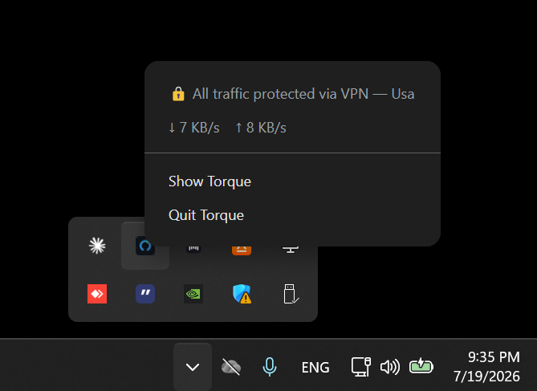
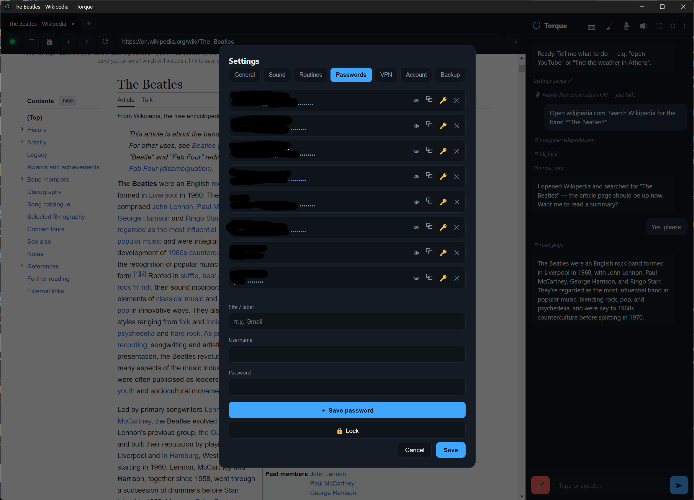
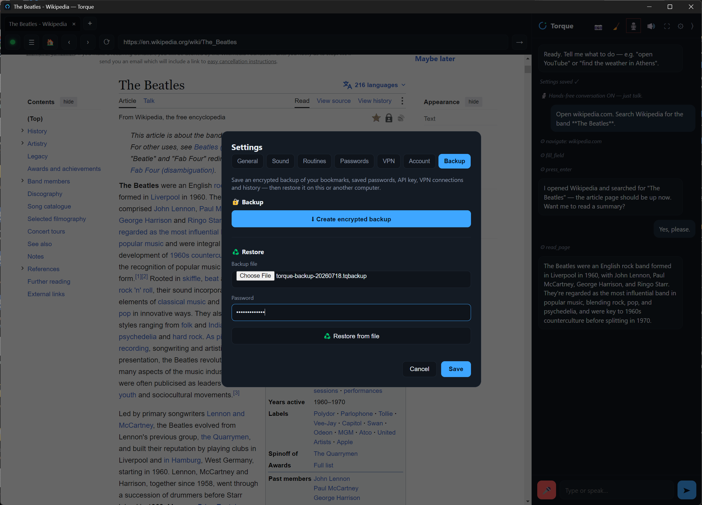

<div align="center">



# Torque

### The browser you talk to.

**A voice-first AI browser for Windows, Linux and Android.** Browse hands-free, ask an assistant that actually reads and acts on the page, and stay private behind a built-in VPN, ad blocker and encrypted password vault.

Your voice is transcribed **on your own device** — it never goes to a cloud service.

<br>


<br>

### [⬇ Download Torque](https://themechanic.store) · [What's new](CHANGELOG.md) · [Support](mailto:support@themechanic.store)

<br>



<sub>**Just say it.** Torque opened Wikipedia, searched for the band, read the article and answered — while you watched.</sub>

</div>

---

## Why Torque

Most browsers make you click. Torque lets you **talk**.

Say what you want and it opens the site, finds the thing, reads the page back to you, or summarises it — without you touching the mouse. Underneath it's a full, modern browser: tabs, bookmarks, downloads, history, reader mode. On top of it sits an assistant that can genuinely *use* the page you are looking at.

And it is built to respect you: speech recognition and speech synthesis run **locally on your machine**, you connect **your own AI key**, and there is **no subscription**.

---

## ✨ What it does

### 🎙️ Voice-first, hands-free

- Talk naturally — Torque listens and acts: open sites, search, scroll, go back, summarise.
- **Speech recognition runs on your computer**, accelerated by your graphics card when one is available.
- Spoken replies, so you can keep your eyes — and your hands — somewhere else.

<br>

### 🧠 An assistant that actually does things

It doesn't just answer. It navigates, fills fields, presses enter, reads the result — and tells you what it found.

- Reads the page you are on and answers questions about it.
- Opens tabs, summarises long articles, takes screenshots.
- **Chat with your open tabs** — ask across everything you have open.
- **Read PDFs** — open a PDF and Torque reads or summarises it, understanding both the text and scanned/image pages.
- **Routines** — describe a task once, in plain words, and let it run on a schedule.

<div align="center">

<br>
<sub>**Routines.** Write it the way you'd say it — *"Open CNN.com and read me the main headlines"* — and it runs every morning.</sub>
</div>

<br>

### 📱 On your phone, too

The same browser, the same assistant, the same routines — on **Android 8.0 or newer**. Your bookmarks, saved passwords and routines come with you.

When a routine is due, Torque turns the screen on by itself and shows you the page over the lock screen, alarm-clock style. The phone stays locked underneath.

<div align="center">

&nbsp;&nbsp;

<br>
<sub>**Android.** Ask for something and watch it navigate and read the page — then the page it opened is right there waiting.</sub>
</div>

<br>

### 📈 Built for people who watch markets

- **Position analysis** — Torque reads your live chart and estimates the odds of reaching your target versus your stop, **without ever navigating away from the chart you are watching**.
- **Prediction markets** — on markets like Polymarket it reads the implied odds and estimates your win probability. Any extra research happens quietly in the background, so your page never changes.
- Paper-trading and Pine-script helpers for TradingView.

> These are estimates and research aids — **not investment advice**. Torque never places, confirms or cancels an order for you.

<br>

### 🔒 A VPN that covers everything

Not a proxy for one tab — a real OpenVPN tunnel that routes **all** your traffic through the country you choose, with IPv6 leak protection so nothing slips outside it.

<div align="center">

<br>
<sub>Add as many countries as you like. Credentials stay <strong>on your machine</strong> — never on our servers.</sub>
</div>

<br>

And you never have to wonder whether it's actually on:

<div align="center">

<br>
<sub>**One glance.** The tray tells you the truth — protected or not — plus live upload and download speed.</sub>
</div>

<br>

### 🔐 Password vault

Your logins, encrypted behind a single master password. Reveal, copy, or lock the vault instantly — nothing is stored in plain text, and nothing leaves your computer.

<div align="center">

<br>
<sub>Passwords are never shown until <em>you</em> ask. One button locks everything again.</sub>
</div>

<br>

### 💾 Your data, and it travels with you

One encrypted file holds your bookmarks, saved passwords, API key, VPN connections *(certificates included)* and history — locked with the master password you already use.

<div align="center">

<br>
<sub>Restore it on another computer — <strong>even a different operating system</strong>. A backup made on Windows restores onto Linux, VPN connections and all.</sub>
</div>

<br>

### 🧰 Everything you expect from a browser

- Download manager with live progress, open-file and open-folder.
- History with search and delete-by-time-range, plus optional clear-on-exit.
- **Immersive fullscreen** where the toolbar, chat and favourites glide in from the screen edges.
- Reader mode and read-aloud.
- Open local PDFs and images from your disk — via the Open-file button or right-click → *Open with* → Torque.
- Export any open PDF to high-resolution PNG images (one page per file).
- Ad & tracker blocker on by default, and private tabs that leave no history.
- Pick your microphone, speaker and camera — Bluetooth headsets included.

---

## ♿ Accessibility

Torque was built so that a browser can be used **without a mouse, a keyboard, or clear eyesight**.

- **Motor impairments** — full hands-free control. Speaking is enough to browse, search, read and navigate.
- **Visual impairments** — read-aloud and reader mode turn any page into clear spoken audio.
- **On-device processing** — because speech is handled locally, using your voice does not mean handing it to a cloud service.

Accessibility here is not a checkbox. It is one of the reasons the product exists.

---

## 🔑 Your AI, your key, your control

Torque connects to Claude using **your own Anthropic API key**, which you paste into Settings. That means:

- You see exactly what you use and what it costs — nothing is hidden behind us.
- Your conversations go straight from your machine to the AI provider.
- **Torque itself is free while we grow.** Later it becomes pay-once — **never a subscription**.

---

## 📦 Install

### 🪟 Windows 10 / 11 (64-bit)

1. Download from **[themechanic.store](https://themechanic.store/download?os=win)**
2. Run `Torque Setup ….exe` and follow the installer.

Updates are automatic and silent — Torque updates itself in the background and installs on the next restart.

### 🐧 Linux (Ubuntu / Debian, amd64)

**Option 1 — `.deb` (simplest)**

Download from **[themechanic.store](https://themechanic.store/download?os=linux)**, then double-click the file and press *Install* — or run it from your Downloads folder:

```bash
sudo apt install ./torque_*.deb
```

Installing the `.deb` also registers Torque's update channel, so future updates arrive through your system like any other app.

**Option 2 — apt (terminal)**

```bash
wget -qO- https://themechanic.store/apt/torque.gpg | sudo tee /usr/share/keyrings/torque.gpg >/dev/null
echo "deb [signed-by=/usr/share/keyrings/torque.gpg] https://themechanic.store/apt ./" | sudo tee /etc/apt/sources.list.d/torque.list
sudo apt update && sudo apt install -y torque
```

**Updating (either option)**

```bash
sudo apt update && sudo apt upgrade
```

> Packages are signed with our GPG key, so `apt` verifies every update before installing it.

### 📱 Android 8.0 or newer

1. Open **[themechanic.store](https://themechanic.store/download?os=android)** on your phone and download the `.apk`.
2. Tap it and allow the install when your phone asks. That prompt is normal for an app you download yourself instead of from a store.

One file covers every phone — it carries both the 64-bit and 32-bit builds. Torque checks for new versions on its own and downloads them **on Wi-Fi only**, then asks you to confirm the install.

---

## 🖥️ Requirements

| | |
|---|---|
| **Windows** | Windows 10 or 11, 64-bit |
| **Linux** | Ubuntu / Debian, amd64 |
| **Android** | Android 8.0 or newer |
| **AI features** | Your own Anthropic API key |
| **Voice** | A microphone. A GPU is optional — it just makes recognition faster. |

*macOS is not available yet.*

---

## 💬 Support

Questions, bug reports or ideas — we read everything.

- 🤖 The **AI assistant** on [themechanic.store](https://themechanic.store) answers install and setup questions instantly.
- ✉️ **[support@themechanic.store](mailto:support@themechanic.store)**

---

<div align="center">

**Torque** — built by [The Mechanic](https://themechanic.store)

© 2026 The Mechanic. All rights reserved.

*This repository is the public home of the Torque project: what it is, what it does, and how to get it.
Torque is proprietary software — its source code is not distributed here.*

</div>
